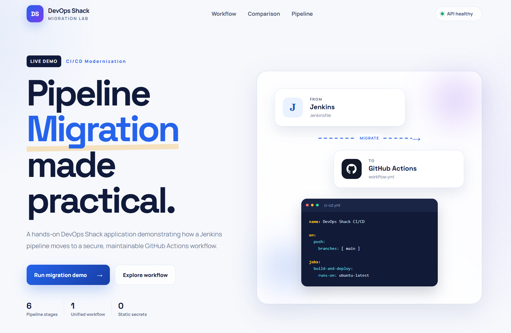
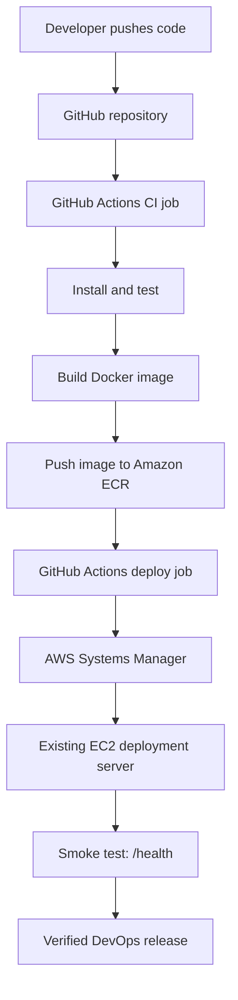
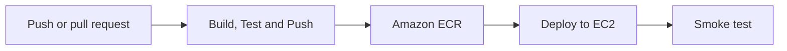

# DevOps Shack

## CI/CD Pipeline Migration Lab

### Jenkins → GitHub Actions → Amazon ECR → Amazon EC2

**A production-style DevOps project that demonstrates how to migrate an end-to-end Jenkins pipeline to GitHub Actions while preserving the existing application and deployment target.**

[](https://devopsshack.com)


**Learn. Build. Automate. — DevOps Shack**

---

## Project overview

This **DevOps Shack CI/CD Pipeline Migration Lab** is a hands-on project for learning how to move pipeline orchestration from a Jenkins server into a repository-native GitHub Actions workflow.

The project keeps the delivery goal unchanged:

1. Check out the application.
2. Install dependencies and run automated tests.
3. Build a Docker image.
4. Authenticate to AWS.
5. Push the versioned image to Amazon ECR.
6. Deploy the container to the existing Amazon EC2 server.
7. Verify the release through the `/health` endpoint.

The application is a Node.js and Express migration dashboard branded for **DevOps Shack**. The same repository contains both pipeline implementations so that every Jenkins stage can be compared with its GitHub Actions replacement.

> **Migration principle:** change the CI/CD orchestrator—not the application, container contract, registry pattern, deployment server, or health-check strategy.

---

## Deployed application preview

The deployed application provides an interactive **DevOps Shack CI/CD Migration Lab** dashboard that visualizes the Jenkins-to-GitHub Actions workflow, pipeline stages, platform comparison and deployment status.



---

## What this DevOps project demonstrates

- A complete **Jenkins-to-GitHub Actions pipeline migration**.
- Jenkins declarative pipeline design using a `Jenkinsfile`.
- Repository-native CI/CD using `.github/workflows/cicd.yml`.
- Node.js dependency installation and automated testing.
- Docker image creation using an immutable commit-based tag.
- Secure GitHub-to-AWS authentication using OpenID Connect (OIDC).
- Amazon ECR authentication and image publishing.
- Agentless EC2 deployment through AWS Systems Manager.
- Container replacement on the existing deployment server.
- Post-deployment smoke testing with a real health endpoint.
- A practical stage-by-stage mapping between Jenkins and GitHub Actions.

---

## End-to-end DevOps architecture



### Platform responsibilities

| Layer | Technology | Responsibility |
|---|---|---|
| Source control | GitHub | Stores application and pipeline-as-code |
| Legacy automation | Jenkins | Runs the original declarative pipeline |
| Migrated automation | GitHub Actions | Runs CI and CD from the repository |
| Runtime | Node.js 22 | Runs the Express application and tests |
| Containerization | Docker | Packages the application consistently |
| Cloud authentication | GitHub OIDC + AWS IAM | Provides short-lived AWS credentials |
| Artifact registry | Amazon ECR | Stores immutable Docker images |
| Remote deployment | AWS Systems Manager | Executes deployment commands on EC2 without SSH |
| Deployment target | Amazon EC2 | Runs the application container |
| Verification | `curl` + `/health` | Confirms the deployed service is healthy |

---

## Pipeline workflow

### GitHub Actions workflow at a glance



The migrated workflow is defined in [`.github/workflows/cicd.yml`](.github/workflows/cicd.yml) and contains two dependent jobs.

### Job 1 — Build, Test and Push

Runs on a GitHub-hosted Ubuntu runner.

| Order | Workflow step | What happens |
|---:|---|---|
| 1 | Checkout | Downloads the repository onto the runner |
| 2 | Set up Node.js | Installs Node.js 22 |
| 3 | Install dependencies | Runs `npm install` |
| 4 | Run tests | Executes `npm test` |
| 5 | Configure AWS credentials | Assumes an IAM role through GitHub OIDC |
| 6 | Verify AWS identity | Runs `aws sts get-caller-identity` |
| 7 | Log in to ECR | Retrieves the registry URL and authenticates Docker |
| 8 | Build image | Builds the application image from the `Dockerfile` |
| 9 | Push image | Pushes the `${{ github.sha }}` tagged image to ECR |

### Job 2 — Deploy to Application EC2

The deployment job uses `needs: build-test-push`, so it starts only after the CI job succeeds.

| Order | Workflow step | What happens |
|---:|---|---|
| 1 | Configure AWS credentials | Assumes the deployment IAM role through OIDC |
| 2 | Send SSM command | Runs the deployment remotely on the EC2 instance |
| 3 | Authenticate to ECR | Allows the EC2 host to pull the private image |
| 4 | Pull image | Downloads the exact commit-tagged image |
| 5 | Replace container | Stops and removes `app`, then starts the new container |
| 6 | Wait for SSM | Blocks until the remote command completes |
| 7 | Smoke test | Calls `http://<EC2_PUBLIC_IP>:8082/health` |

### Image lifecycle

```text
Source commit
   → GitHub SHA image tag
   → Amazon ECR repository
   → EC2 Docker pull
   → app container
   → /health verification
```

Using `${{ github.sha }}` makes every GitHub Actions image traceable to the exact source commit that produced it.

---

## Jenkins-to-GitHub Actions mapping

The migration preserves the delivery logic while replacing Jenkins-specific constructs with GitHub-native equivalents.

| Jenkins | GitHub Actions | Migration meaning |
|---|---|---|
| `Jenkinsfile` | `.github/workflows/cicd.yml` | Pipeline as code remains in the repository |
| `pipeline {}` | Workflow YAML | Top-level pipeline definition |
| `agent any` | `runs-on: ubuntu-latest` | Selects the execution environment |
| `tools { nodejs 'nodejs22' }` | `actions/setup-node` | Installs Node.js 22 |
| `environment {}` | `env:` | Defines shared environment variables |
| `stages {}` | `jobs:` and `steps:` | Organizes the delivery lifecycle |
| `stage('Test')` | `Run tests` step | Runs the same automated test command |
| `checkout scm` | `actions/checkout` | Retrieves source code |
| `${BUILD_NUMBER}` | `${{ github.sha }}` | Creates a unique image version |
| Jenkins/AWS agent credentials | GitHub OIDC role assumption | Replaces persistent credentials with short-lived access |
| Shell deployment on agent | SSM command from deploy job | Separates the CI runner from the target server |
| `post { success/failure }` | Job status and logs | Reports workflow outcome |

### What changes and what remains unchanged

| Changes during migration | Remains unchanged |
|---|---|
| Pipeline orchestrator | Application source code |
| Pipeline syntax | Node.js runtime contract |
| Runner/agent model | Dockerfile and container port `8080` |
| Credential delivery mechanism | Amazon ECR image registry pattern |
| Remote deployment mechanism | Existing EC2 deployment server |
| Pipeline visibility and logs | Health endpoint and smoke-test goal |

> The sample Jenkins and GitHub Actions files currently use different ECR repository names. For a strict like-for-like migration, configure both pipelines to publish to the same approved ECR repository, or intentionally keep separate repositories during parallel validation.

---

## Repository structure

```text
Migration-Demo-Project-main/
├── .github/
│   └── workflows/
│       └── cicd.yml          # Migrated GitHub Actions CI/CD pipeline
├── public/
│   ├── app.js                # Interactive migration workflow UI
│   ├── index.html            # DevOps Shack migration dashboard
│   └── styles.css            # Application styling
├── .dockerignore             # Docker build exclusions
├── Dockerfile                # Node.js 22 production image
├── Jenkinsfile               # Original Jenkins pipeline
├── package.json              # Application scripts and dependencies
├── server.js                 # Express server and API endpoints
├── test.js                   # Automated health, UI and API tests
└── README.md                 # DevOps project documentation
```

---

## Technology stack

| Category | Tools |
|---|---|
| Application | Node.js 22, Express 5, HTML, CSS, JavaScript |
| Source control | Git and GitHub |
| CI/CD | Jenkins and GitHub Actions |
| Container platform | Docker |
| Cloud | AWS IAM, STS, ECR, Systems Manager and EC2 |
| Testing | Node.js test script and HTTP smoke test |
| DevOps practices | Pipeline as code, immutable tagging, OIDC, remote deployment and health validation |

---

## Prerequisites

### For local execution

- Node.js 22+
- npm
- Docker, if running the containerized version

### For Jenkins execution

- Jenkins controller and an available agent
- Node.js tool configured in Jenkins as `nodejs22`
- Docker installed and accessible to the Jenkins agent
- AWS CLI configured on the agent
- AWS permissions for STS and ECR
- Access to the deployment Docker host used by the Jenkins pipeline

### For GitHub Actions execution

- A GitHub repository containing this project
- An Amazon ECR repository
- A GitHub OIDC provider configured in AWS IAM
- An IAM role named `GitHubActionsMigrationRole`, or an updated role name in the workflow
- An EC2 deployment instance managed by AWS Systems Manager
- Docker and AWS CLI installed on the EC2 instance
- An EC2 instance profile that can connect to SSM and pull images from ECR
- Network access to the application on port `8082` for the smoke test

---

## Run the DevOps Shack application locally

```bash
git clone https://github.com/<YOUR_ACCOUNT>/<YOUR_REPOSITORY>.git
cd Migration-Demo-Project-main
npm install
npm test
npm start
```

Open:

```text
http://localhost:8080
```

### Application endpoints

| Endpoint | Purpose | Expected result |
|---|---|---|
| `/` | DevOps Shack migration dashboard | HTML page |
| `/health` | Runtime health check | HTTP 200 with `status: UP` |
| `/api/migration` | Migration metadata | JSON describing the demo stages |

Example health check:

```bash
curl http://localhost:8080/health
```

---

## Run with Docker

Build the image:

```bash
docker build -t devopsshack/migration-demo:local .
```

Start the container:

```bash
docker run --rm --name migration-demo -p 8081:8080 \
  devopsshack/migration-demo:local
```

Verify it:

```bash
curl http://localhost:8081/health
```

The Docker image runs as the non-root `node` user and exposes application port `8080`.

---

## AWS and GitHub configuration

### 1. Create the ECR repository

The GitHub Actions workflow expects:

```text
migration-pipeline-reg
```

Create it in `ap-south-1`, or update `AWS_REGION` and `ECR_REPOSITORY` in the workflow.

### 2. Configure GitHub repository variables

Go to **GitHub repository → Settings → Secrets and variables → Actions → Variables**.

| Variable | Purpose |
|---|---|
| `AWS_ACCOUNT_ID` | Builds the IAM role ARN and ECR registry URL |
| `EC2_INSTANCE_ID` | Identifies the SSM-managed deployment instance |
| `EC2_PUBLIC_IP` | Used by the post-deployment smoke test |

No long-lived AWS access key is required by this workflow.

### 3. Configure GitHub OIDC in AWS

The workflow requires:

```yaml
permissions:
  id-token: write
  contents: read
```

`id-token: write` allows the workflow to request a GitHub OIDC token. AWS validates that token and issues temporary credentials for the IAM role.

Restrict the role trust policy to the intended organization, repository and branch. A typical subject condition is:

```text
repo:<GITHUB_ORG>/<REPOSITORY>:ref:refs/heads/main
```

The GitHub Actions role needs only the permissions required to:

- Call `sts:GetCallerIdentity`.
- Authenticate and push images to the selected ECR repository.
- Call `ssm:SendCommand` for the selected EC2 instance.
- Read the SSM command result while the workflow waits for completion.

### 4. Prepare the EC2 deployment target

The EC2 instance must:

- Be online and registered as an SSM managed node.
- Have the SSM Agent running.
- Have Docker installed and running.
- Have AWS CLI available to the remote shell.
- Use an instance profile with `AmazonSSMManagedInstanceCore`-equivalent access.
- Have least-privilege ECR pull permissions.
- Allow application traffic on port `8082` from the required source range.

---

## Migration runbook

Use this order when moving a real pipeline from Jenkins to GitHub Actions.

### Phase 1 — Discover

- Inventory every Jenkins stage, tool, credential and integration.
- Record triggers, parameters, agents, timeouts and post-build actions.
- Identify which deployment behaviors must remain unchanged.

### Phase 2 — Map

- Convert Jenkins agents to GitHub-hosted or self-hosted runners.
- Convert Jenkins tools to setup actions.
- Convert stages into jobs and steps.
- Replace Jenkins credentials with GitHub OIDC, secrets or environment protection.

### Phase 3 — Build CI first

- Implement checkout, runtime setup, dependency installation and tests.
- Build the same Docker image locally and in both CI systems.
- Keep Jenkins as the active deployment path during early validation.

### Phase 4 — Publish safely

- Push commit-tagged images from GitHub Actions.
- Confirm image architecture, labels, digest and ECR repository path.
- Compare the Jenkins and GitHub-produced artifacts.

### Phase 5 — Add deployment

- Deploy the exact image produced by the CI job.
- Use SSM instead of opening SSH access to the runner.
- Run an automated smoke test after container startup.

### Phase 6 — Parallel validation

- Run Jenkins and GitHub Actions for the same representative commits.
- Compare test results, images, logs, deployment time and application health.
- Keep the Jenkins pipeline available as a fallback until acceptance criteria pass.

### Phase 7 — Cut over and retire

- Make GitHub Actions the authoritative pipeline.
- Protect the production branch and deployment environment.
- Monitor the first releases closely.
- Retire Jenkins credentials, jobs and infrastructure only after the rollback window closes.

---

## Release validation and rollback

### Validation checklist

- [ ] Tests passed before the image was built.
- [ ] AWS identity matches the expected account and role.
- [ ] ECR contains the expected commit-tagged image.
- [ ] SSM command completed successfully.
- [ ] The `app` container is running on EC2.
- [ ] Port `8082` maps to container port `8080`.
- [ ] `/health` returns HTTP 200 and `status: UP`.
- [ ] Application logs show no startup failures.

### Basic rollback strategy

Because images are tagged with an immutable Git SHA, rollback can reuse a previously verified image:

```bash
docker pull <ACCOUNT_ID>.dkr.ecr.<REGION>.amazonaws.com/<REPOSITORY>:<PREVIOUS_SHA>
docker stop app || true
docker rm app || true
docker run -d --name app -p 8082:8080 \
  <ACCOUNT_ID>.dkr.ecr.<REGION>.amazonaws.com/<REPOSITORY>:<PREVIOUS_SHA>
curl --fail http://localhost:8082/health
```

For production systems, add load-balancer health checks or a blue-green strategy to prevent service interruption during container replacement.

---

## Security and production hardening

This project already demonstrates several strong DevOps security practices:

- Short-lived AWS credentials through OIDC.
- No static AWS keys stored in the repository.
- Least-privilege `contents: read` repository permission.
- Non-root application user inside the Docker image.
- Immutable Git SHA image tags.
- Agentless remote execution through Systems Manager.
- Automated post-deployment health verification.

Recommended production enhancements:

- Restrict the IAM trust policy to the exact repository and protected branch.
- Scope ECR and SSM permissions to named resources.
- Deploy only after a successful push to the protected `main` branch.
- Add GitHub Environment approvals for production.
- Pin actions to reviewed commit SHAs where required by policy.
- Add dependency, secret, source, filesystem and container-image scanning.
- Record image digests and generate an SBOM.
- Add concurrency controls to prevent overlapping deployments.
- Add timeouts, retry rules and deployment notifications.
- Place the application behind HTTPS and a load balancer.

> The web dashboard visualizes a conceptual **Security** stage. The current workflow does not execute a scanner yet. Add tools such as Gitleaks, SonarQube and Trivy before treating that visual stage as implemented.

### Pull-request deployment note

The current workflow listens to both `push` and `pull_request` events. In a production repository, keep pull requests validation-only by adding a deployment condition such as:

```yaml
deploy:
  if: github.event_name == 'push' && github.ref == 'refs/heads/main'
```

This prevents unmerged pull-request code from reaching the deployment environment.

---

## Troubleshooting

| Problem | What to verify |
|---|---|
| OIDC role cannot be assumed | IAM OIDC provider, role ARN, audience and repository subject condition |
| `ecr:GetAuthorizationToken` denied | GitHub Actions role contains the ECR authorization permission |
| ECR push denied | Repository name, region and repository-scoped upload permissions |
| SSM command fails | Instance is managed by SSM, instance ID is correct and SSM Agent is online |
| EC2 cannot pull the image | EC2 instance role has ECR pull access and uses the correct region |
| Container will not start | Docker logs, port conflict, image architecture and application startup output |
| Smoke test fails | Security group, public IP, port `8082`, startup delay and `/health` response |
| GitHub workflow does not start | Workflow path, YAML syntax and `main` branch trigger |

Useful checks on the EC2 instance:

```bash
sudo systemctl status amazon-ssm-agent
sudo systemctl status docker
docker ps -a
docker logs app
curl -i http://localhost:8082/health
```

---

## DevOps learning outcomes

After completing this **DevOps Shack** project, you should be able to explain and demonstrate:

- How Jenkins concepts translate into GitHub Actions concepts.
- Why CI and CD should be separated into dependent jobs.
- How OIDC removes the need for stored cloud access keys.
- How ECR registry output is passed into Docker build and push commands.
- Why immutable image tags improve traceability and rollback.
- How SSM enables remote deployment without direct SSH from CI.
- Why deployment completion and application health are different checks.
- How to migrate a pipeline incrementally without changing the application server.

---

## About DevOps Shack

**DevOps Shack** creates practical, production-oriented learning content across DevOps, DevSecOps, cloud, containers, Kubernetes, Terraform, GitOps, observability and AI for DevOps.

- Website: [devopsshack.com](https://devopsshack.com)
- GitHub: [github.com/jaiswaladi246](https://github.com/jaiswaladi246)

### Built for the DevOps community by DevOps Shack

**Learn. Build. Automate.**
